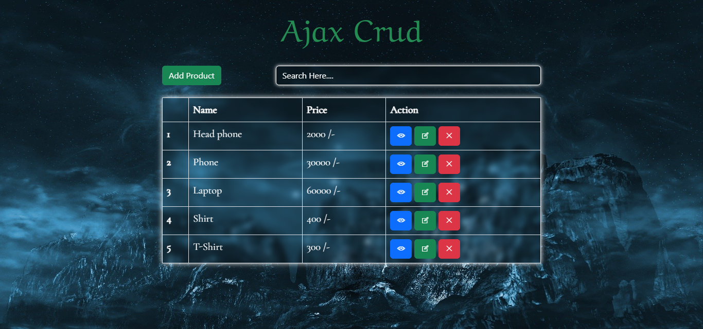

# Ajax CRUD with Laravel !

It's a simple **Ajax CRUD with Laravel** one page project (for other pages using modal) and without reloading or refreashing page can...
 - Add
 - Edit 
 - Delete
 - Search
 - Pagination

## Author

[Fatema Akther Prianka 🤗](https://github.com/Prianka-Mimi)

## Features

- Add with modal 

- Edit with modal

- Add and Edit Validation

- Delete with confirmation

- Search

- Pagination

## Has Been Used

 - Html
 - Css
 - Bootstrap
 - Java Script
	- JQuery
    - Toastr
 - Ajax
 - Laravel

	
## View In Short

**Welcome Page**

**Add Modal**

**Add Validation**

**Edit Modal**

**Edit Validation**

**Delete with confirmation**

**Search**

**Pagination and Toastr message**

  
## Contact

[🌐 Fatema Akther Prianka](https://webdeveloperprianka.netlify.app/)

[Linkedin](https://www.linkedin.com/in/fatema-akther-prianka/)

[FaceBook](https://www.facebook.com/fatemaaktherprianka.webdeveloper)

[Stack Overflow](https://stackoverflow.com/users/23182049/prianka-mimi)
